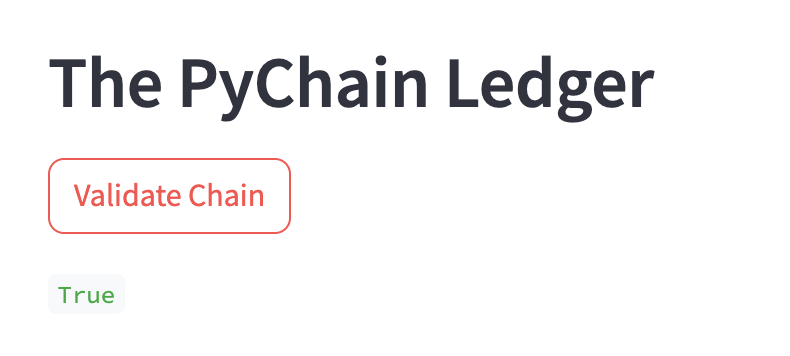

# PyChain Ledger

## Summary of Streamlit Application

The application provides a user interface to interact with a blockchain ledger called PyChain. This ledger is implemented using a series of blocks, where each block contains transaction records. It defines a Record data class representing individual transactions where each transaction includes sender, receiver, and amount attributes. It also defines a Block data class representing a block in the blockchain. Each block contains a record (transaction), along with other attributes like creator ID, previous hash, timestamp, and nonce. This class represents the blockchain itself and also includes methods for adding blocks to the chain, performing proof of work for mining new blocks, and validating the blockchain. The blocks are hashed using SHA-256. 

Focusing on the Streamlit application - the interface allows users to input transaction details (sender, receiver, amount) and add them to the PyChain ledger. Users can also adjust the difficulty level for mining new blocks using a slider. The sidebar section on the left allows users to inspect individual blocks within the chain and they can select a block from a dropdown menu to view its details. The application also includes a button to validate the entire blockchain.

Overall, the PyChain ledger Streamlit application provides a user-friendly interface for managing a blockchain ledger, enabling users to add transactions, inspect individual blocks, and validate the blockchain.

Below are picture demonstrations of the interface, displaying a blockchain consisting of several blocks and confirmation that the blockchain is valid.

